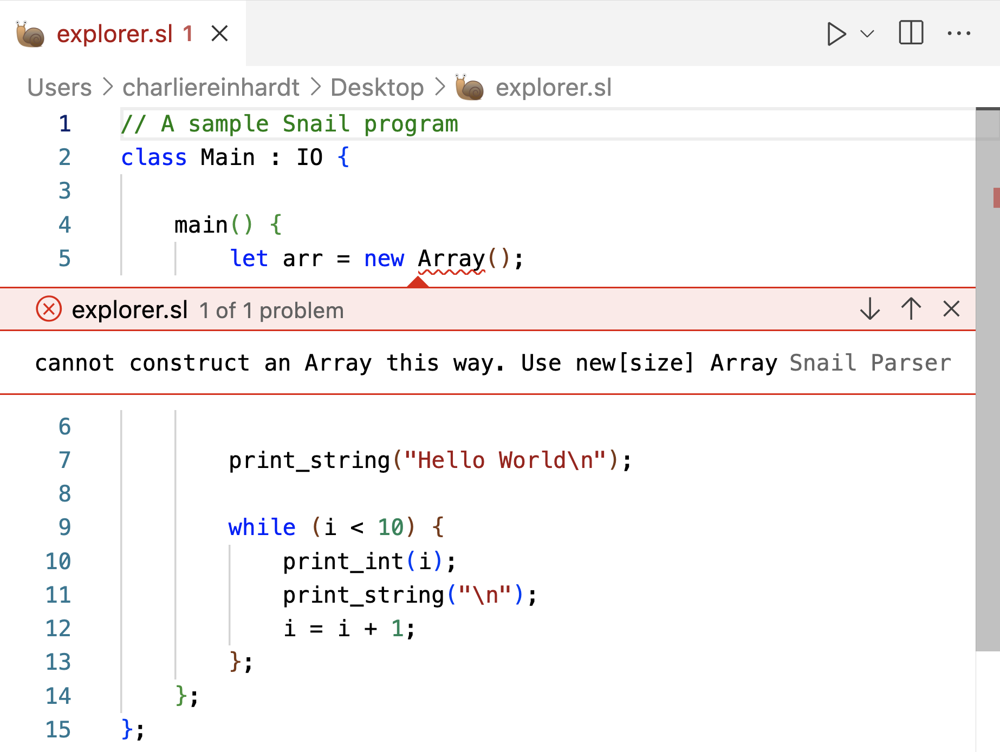

# Snail Language Support

The Snail Language Support aims to add language support for the [snail programming language](https://snail-language.github.io/), developed by Assistant Professor [Kevin Angstadt](https://myslu.stlawu.edu/~kangstadt/) at St. Lawrence University. 

## Features

Snail Language Support adds a number of features to the snail language

### Static Error Checking

Snail Language Support provides static error checking of lexing and parsing errors. Runtime/Interpreter errors are currently not supported or checked.



### Rudimentary autocomplete

Snail Language Support also provides basic autocomplete for common code structures, such as if statements, while loops, and variable definitions. To utilize this function, type the following prompts in a snail file, and press `tab` to select the appropriate autocomplete.

For a more detailed description of intended outputs, see `snippets/snippets.json`

| List of Snippet Prompts |
| :-- |
| `if` |
| `while` |
| `class` |
| `class-inherits` |
| `class M` * | 
| `class m` * |
| `main` * |
| `Main` * |
| `main-inherits` + |
| `Main-inherits` + |
| `method-def` |
| `let` |
| `let-def` |

\* all equivalent prompts that give the following output
```javascript
	class Main {
	    main() {
			
        };	
	};
```

\+ both equivalent prompts that give the following output 
```javascript
	class Main : {
	    main() {
			
        };	
	};
```

## Requirements

Snail Language Support requires an installation of snail of version 1.3.0 or greater. To check your version of snail, run the following command

```bash
snail -v 
# OR, snail --version
```

If a snail interpreter is not found, or it has version <1.3.0, see installation instructions [here](https://snail-language.github.io/downloads).

## Extension Settings

There are a few notable settings provided in this extension that are worth configuring prior to using this extension. 

* `snailLanguageServer.snailPath`: Absolute path to snail executable to use for Language Server. This is required for static error checking.
* `snailLanguageServer.maxNumberOfProblems`: The maxmimum number of problems our language server is allowed to produce when looking at a single file. In practice, Snail Language Support's current implementation of a language server is unable to produce more than one problem.
* `snailLanguageServer.trace.server`: Traces the communication between VS Code and the language server. Primarily for debugging purposes. `off`, `message`, or `verbose`

## Issues

If you encounter an issue with the Snail Langauge Support extension (bug, feature request, or other), please open an issue on our Snail Language Support GitHub page. 

## Release Notes

### 1.0.0

Initial release of Snail Language Support