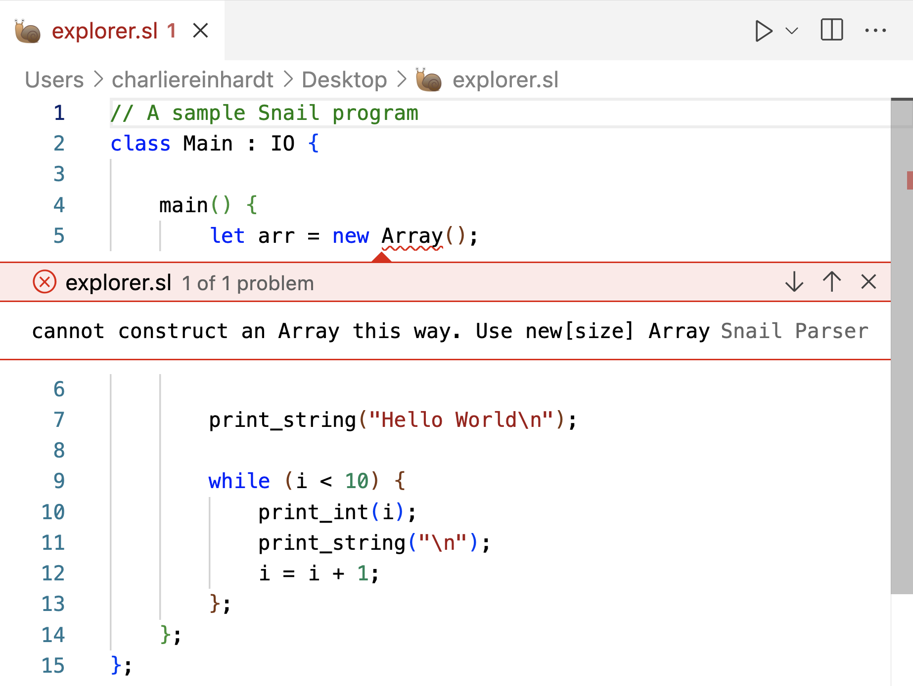

# Snail Language Support

The Snail Language Support aims to add language support for the [snail programming language](https://snail-language.github.io/), developed by Assistant Professor [Kevin Angstadt](https://myslu.stlawu.edu/~kangstadt/) at St. Lawrence University. 

## Installation

Currently, Snail Language Support is not available on the online VS Code extension marketplace. To install, please follow the instructions below.

## Features

Snail Language Support adds a number of features to the snail language

### Static Error Checking

Snail Language Support provides static error checking of lexing and parsing errors. Runtime/Interpreter errors are currently not supported or checked.



### Rudimentary autocomplete

Snail Language Support also provides basic autocomplete for common code structures, such as if statements, while loops, and variable definitions. To utilize this function, type a snippet 'trigger' (listed below) in a snail file, and press `tab` to select the appropriate autocomplete.

For a more detailed description of intended outputs, see `snippets/snippets.json`

| Trigger | Content |
| :-- | :-- |
| `if` | if-else conditional |
| `while` | while loop |
| `class` | standard class definition |
| `class-inherits` | class that inherits from superclass definition |
| `class M` | `Main` class with `main()` method |
| `class m` | `Main` class with `main()` method |
| `main` | `Main` class with `main()` method |
| `Main` | `Main` class with `main()` method |
| `main-inherits` | `Main` class inheriting from superclass with `main()` method |
| `Main-inherits` | `Main` class inheriting from superclass with `main()` method |
| `method-def` | standard method definition |
| `let` | standard variable declaration |
| `let-def` | standard variable declaration and assignment |

## Requirements

Snail Language Support requires an installation of snail of version 1.3.0 or greater. To check your version of snail, run the following command

```bash
# Check for snail version >1.3.0
snail -v 
```

If a snail interpreter is not found, or it has version <1.3.0, see installation instructions [here](https://snail-language.github.io/downloads).

## Extension Settings

There are a few notable settings provided in this extension that are worth configuring prior to using this extension. 

* `snailLanguageServer.snailPath`: Absolute path to snail executable to use for Language Server. This is required for static error checking.
* `snailLanguageServer.maxNumberOfProblems`: The maxmimum number of problems our language server is allowed to produce when looking at a single file. In practice, Snail Language Support's current implementation of a language server is unable to produce more than one problem.
* `snailLanguageServer.trace.server`: Traces the communication between VS Code and the language server. Primarily for debugging purposes. `off`, `message`, or `verbose`

## Issues

If you encounter an issue with the Snail Langauge Support extension (bug, feature request, or other), please open an issue on our [GitHub Repository](https://github.com/snail-language/snail-language-support/issues). 

### Known Issues

There are a few known issues/bugs that you may encounter that are under plans for future work. 

* When changing the `snailLanguageServer.snailPath` setting, you must [developer reload](https://stackoverflow.com/questions/42002852/how-to-restart-vscode-after-editing-extensions-config#:~:text=Execute%20the%20workbench,reloadWindow%22%2C%0A%20%20%20%20%22when%22%3A%20%22editorTextFocus%22%0A%20%20%7D%0A%5D) your VS Code window in order to allow the language server to restart and the change to take effect. 

## Development

There are a number of things that are helpful to know when starting development on this extension. They are noted below.

### Testing locally

### Packaging Extension for distribution

As Snail Language Support is not available on the VS Code extension marketplace, we release a new downoadable packaged extension `.vsix` file with each change. We use the [Visual Studio Code Extensions](https://code.visualstudio.com/api/working-with-extensions/publishing-extension#vsce) command line tool `vsce` to do this. To generate this packaged extension, follow the instructions below.

NOTE: the online `vsce` documentation includes directions to publish the extension to the online marketplace. Be sure to read online documentation carefully to avoid publishing to the online marketplace.

```bash
# Ensure that you have the vsce tool installed
npm install -g @vscode/vsce

# Navigate to the snail-language-support directory
cd path/to/snail-language-support

# package the extension src files
vsce package
```

This should generate a `snail-language-support-1.x.x.vsix` file. Include this file when you push any changes to the Snail Language Support repository.

## Release Notes

### 1.0.0

Initial release of Snail Language Support