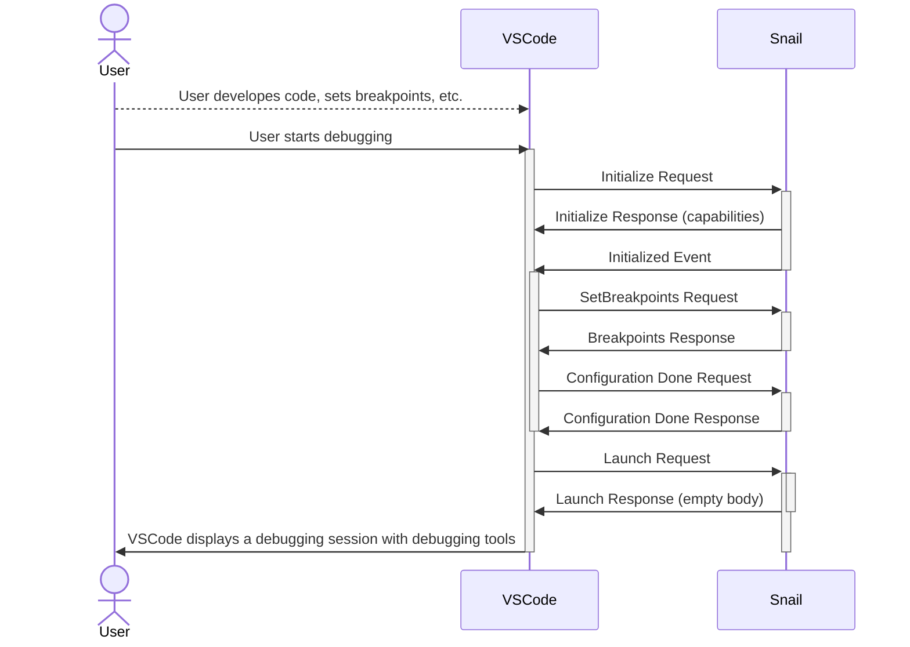
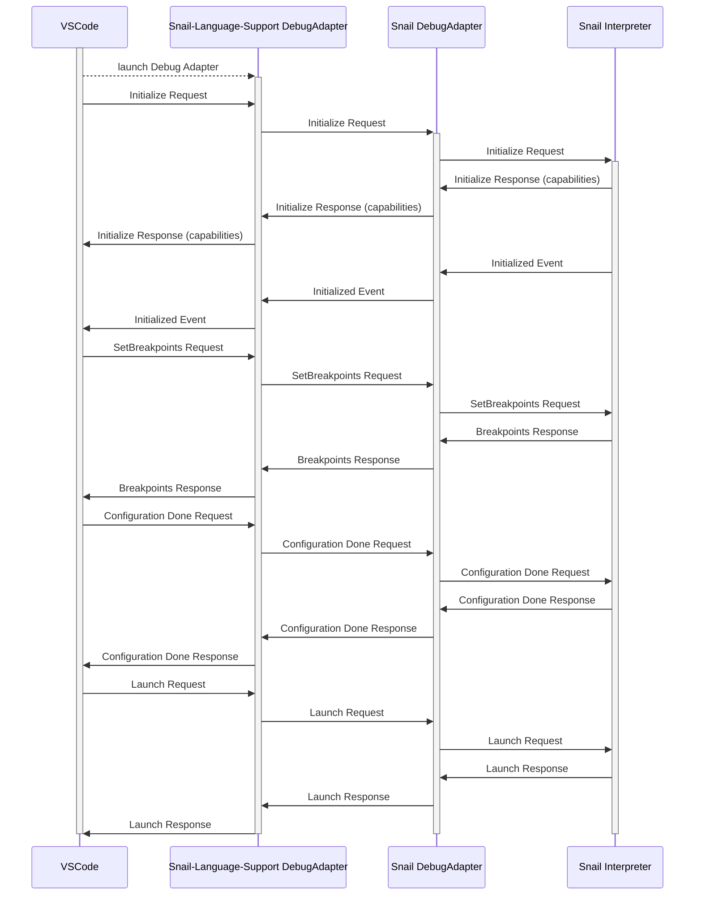
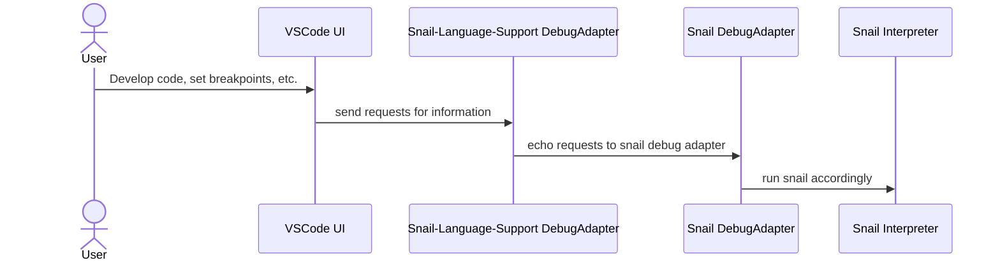

# Sequence Diagrams

These are some diagrams that highlight how a user, VSCode, and Snail all interact with eachother.

## Top Level

In this diagram, we model how a user interacts with VSCode and how VSCode interacts with Snail to offer debugging capabilities to the user.

# Inside our extension

This diagaram highlights some inner interactions with our extension and snail program.

# Overall

this diagram highlights an end-to-end interaction overview

