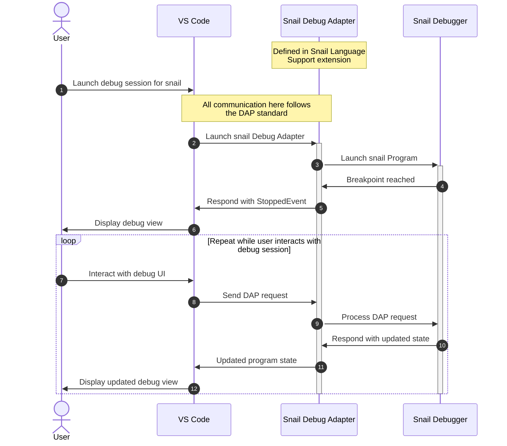

```mermaid
sequenceDiagram

    autonumber

    actor U as User
    participant V as VS Code
    participant DA as Snail Debug Adapter
    note over DA: Defined in Snail Language <br> Support extension
    participant D as Snail Debugger

    U ->> V: Launch debug session for snail
    note over V, DA: All communication here follows <br> the DAP standard
    V ->> + DA: Launch snail Debug Adapter

    DA ->> + D: Launch snail Program
    D ->> DA: Breakpoint reached
    DA ->> V: Respond with StoppedEvent
    V ->> U: Display debug view
    loop Repeat while user interacts with debug session
        U ->> V: Interact with debug UI
        V ->> DA: Send DAP request
        DA ->> D: Process DAP request
        D ->> DA: Respond with updated state
        DA ->> V: Updated program state
        V ->> U: Display updated debug view
    end

    deactivate D
    deactivate DA
```