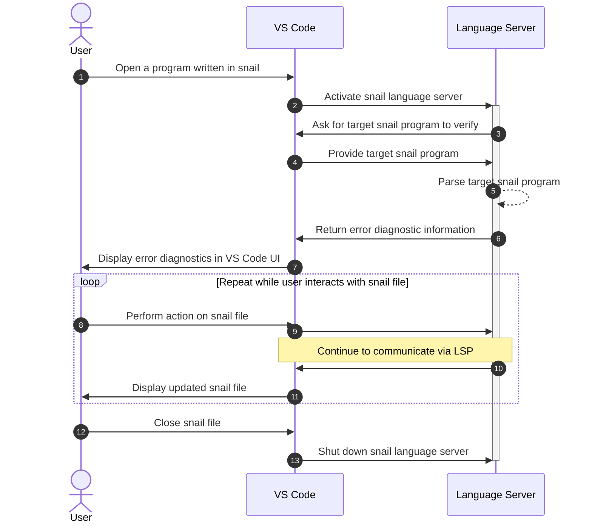

```mermaid
sequenceDiagram

    autonumber

    actor U as User
    participant V as VS Code
    participant L as Language Server

    U ->> V: Open a program written in snail
    V ->> + L: Activate snail language server

    L ->> V: Ask for target snail program to verify
    V ->> L: Provide target snail program
L -->> L: Parse target snail program
    L ->> V: Return error diagnostic information
    V ->> U: Display error diagnostics in VS Code UI
    
    loop Repeat while user interacts with  snail file
    U ->> V: Perform action on snail file
    V ->> L: 
    Note over L, V: Continue to communicate via LSP
    L ->> V: 
    V ->> U: Display updated snail file
    end

    U ->> V: Close snail file
    V ->> L: Shut down snail language server

    deactivate L
```