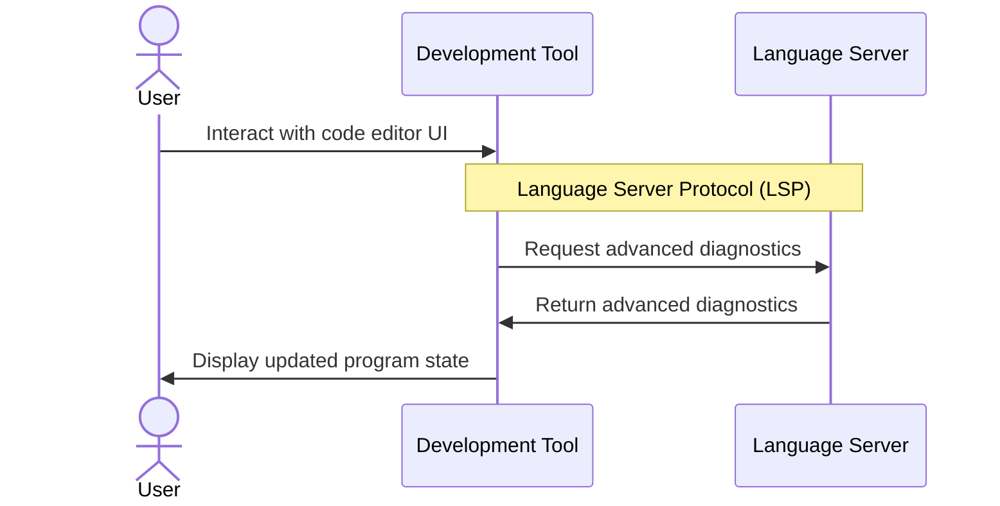
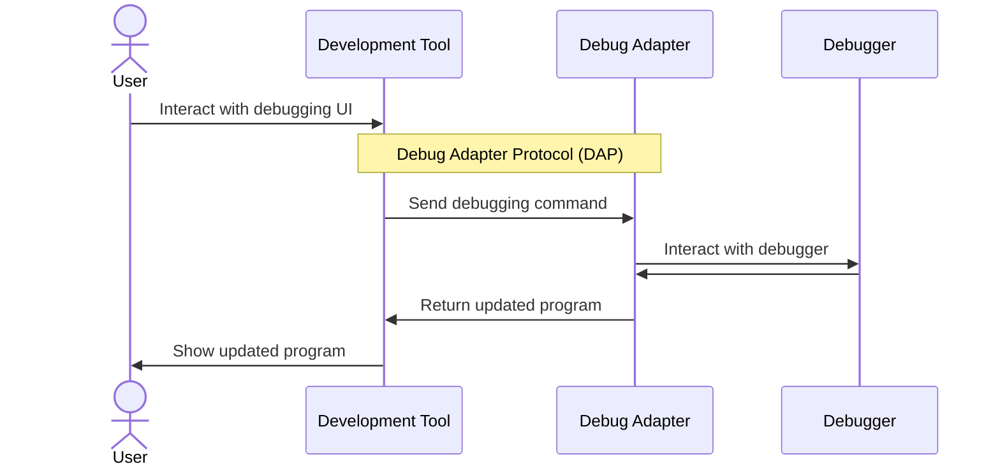

LSP basic stucture

```mermaid
sequenceDiagram

    actor U as User
    participant D as Development Tool
    participant L as Language Server

    U ->> D: Interact with code editor UI
    note over D,L: Language Server Protocol (LSP)
    D ->> L: Request advanced diagnostics
    L ->> D: Return advanced diagnostics
    D ->> U: Display updated program state
```

DAP basic structure

```mermaid
sequenceDiagram

    actor U as User
    participant D as Development Tool
    participant Debug as Debug Adapter
    participant Debugger

    U ->> D: Interact with debugging UI
    note over D, Debug: Debug Adapter Protocol (DAP)
    D ->> Debug: Send debugging command
    Debug ->> Debugger: Interact with debugger

    Debugger ->> Debug: 
    Debug ->> D: Return updated program
    D ->> U: Show updated program

```